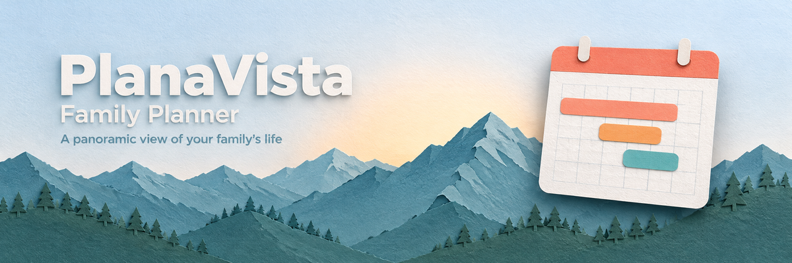
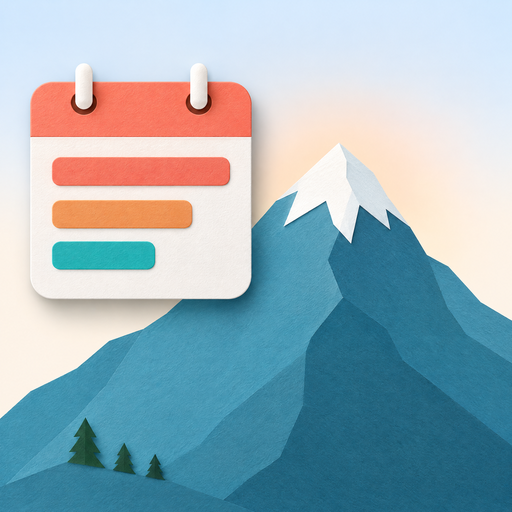

<p align="center">
  
</p>

<h1 align="center">PlanaVista</h1>

<p align="center">
  <strong>A panoramic view of your family's life</strong><br>
  A beautiful, privacy-first wall calendar for Home Assistant that rivals Skylight and Hearth, with no monthly fees.
</p>

<p align="center">
  <a href="https://github.com/tavenhall1/planavista/releases"></a>
  <a href="https://github.com/tavenhall1/planavista/blob/main/LICENSE"></a>
  <a href="https://github.com/hacs/integration"></a>
</p>

---

## Features

- **4 Calendar Views**: Day (per-person columns), Week, Month, and Agenda
- **Deep Google Calendar Integration**: Attendee invitations, in-place PATCH edits, real organizer detection via API
- **Shared Event Awareness**: Multi-participant detection, organizer badges, stripe gradients, participant avatars
- **Full Event Management**: Create, edit, and delete events with optional address suggestions and multi-calendar support
- **Past Event Dimming**: Finished events automatically fade so you can focus on what's next
- **20-Color Palette**: Earth, ocean, warm, and vivid tones for calendar personalization
- **Built-in Onboarding Wizard**: Auto-discovers your calendars, weather, and people entities
- **Theme Customizer**: 4 base themes + accent color, background, header gradient, corners, and shadows
- **Animated Weather**: 15 custom SVG icons with condition-based gradients and forecasts
- **Per-Person Day View**: Skylight-inspired columns with large person avatars
- **Fully Responsive**: Optimized for phones, tablets, wall displays, and large screens
- **Easy Install via HACS**: No YAML or code required, just point-and-click setup
- **Local by Default**: Your calendar data stays on your network; the only optional lookup is address suggestions, which is off until you turn it on

---

## Quick Start

### 1. Set Up Your Calendars

Make sure you have at least one calendar integration configured:

- **[Google Calendar](https://www.home-assistant.io/integrations/google/)**: Settings > Integrations > Google Calendar
- **Local Calendar**: Settings > Integrations > Local Calendar
- Any integration that creates `calendar.*` entities

### 2. Install PlanaVista

#### HACS (Recommended)

1. Open **HACS** in Home Assistant
2. Go to **Integrations** (not Frontend)
3. Click the **three-dot menu** (top right) and select **Custom repositories**
4. Add this repository URL:
   ```
   https://github.com/tavenhall1/planavista
   ```
5. Set category to **Integration** and click **Add**
6. Search for **PlanaVista** and click **Download**
7. **Restart Home Assistant**

#### Manual

1. Download the `custom_components/planavista` folder from this repository
2. Copy it into your Home Assistant `config/custom_components/` directory
3. Restart Home Assistant

### 3. Add the PlanaVista Integration

1. Go to **Settings > Devices & Services**
2. Click **Add Integration**
3. Search for **PlanaVista**
4. Follow the single-step setup (calendars are auto-discovered)

### 4. Add the Card to a Dashboard

1. Open your dashboard and click **Edit**
2. Click **Add Card**
3. Search for **PlanaVista**
4. Save: the onboarding wizard will appear on first load

The wizard walks you through preferences, calendar personalization (name, color, avatar), and theme selection. No YAML required.

### 5. Card YAML Options (Optional)

The card works with zero configuration, but you can override settings per-card:

```yaml
type: custom:planavista-calendar-card
entity: sensor.planavista_config

# Optional overrides
default_view: week          # day | week | month | agenda
calendars:                  # show only specific calendars
  - calendar.alice
  - calendar.bob
hide_weather: false         # hide the weather widget
hide_header: false          # hide the entire header bar
weather_entity: weather.home
time_format: 12h            # 12h | 24h
first_day: sunday           # sunday | monday
```

---

## Calendar Views

### Day View

Per-person columns showing each family member's schedule side-by-side, inspired by Skylight's hero view.

- Large person avatars as column headers
- All-day event banner pills spanning the top
- Timed event blocks with overlap detection
- Now indicator line with auto-scroll to current time
- Shared event participant avatars on event blocks
- Next-day footer navigation at the bottom of the time grid
- Past events automatically dimmed

### Week View

A card-based grid showing the full week at a glance.

- Day cards in a responsive grid (4 columns on desktop, 2 on tablet, 1 on phone)
- Event chips with multi-participant stripe gradients for shared events
- Weather forecast per day with hi/lo temps and animated icons
- Today's card highlighted with accent border
- Quick "+ Add" button on each day card
- Event count badges
- Past events automatically dimmed

### Month View

Traditional calendar grid for long-range planning.

- 6-week grid with compact event pills
- "+N more" overflow for busy days
- Today indicator circle
- Click any day to jump to its day view
- Compact event chips with stripe support for shared events
- Past events automatically dimmed

### Agenda View

A scrolling list for quickly scanning upcoming events.

- Sticky date headers with relative labels ("Today", "Tomorrow", "In 2 days")
- Weather forecast per day
- Lazy "Load more days" pagination (14 days at a time)
- "+ Add event" button per day
- Past events automatically dimmed

---

## Google Calendar Integration

PlanaVista goes beyond Home Assistant's built-in calendar services to provide deep Google Calendar API integration for families sharing events.

- **Attendee Invitations**: When creating events on multiple calendars, PlanaVista invites attendees via the Google Calendar API so events stay properly linked
- **In-Place Event Editing**: Shared events are updated via PATCH requests, preserving event links and attendee lists (no delete-and-recreate)
- **Real Organizer Detection**: Each event's true organizer is fetched from the Google Calendar API, enabling accurate "who created this?" display
- **Shared Event Deduplication**: When the same event appears on multiple family members' calendars, PlanaVista detects and displays it once with participant indicators
- **Smart Delete**: The organizer sees "Delete Event" (removes for everyone); attendees see "Remove Me" (removes only their copy)
- **Graceful Fallback**: Non-Google calendars (Local Calendar, CalDAV, etc.) work normally using standard Home Assistant services

---

## Themes

PlanaVista ships with four built-in themes: **Light**, **Dark**, **Minimal**, and **Vibrant**.

On top of any base theme, you can customize:

| Setting | Options |
|---------|---------|
| **Accent Color** | Any color from the 20-swatch palette or custom picker |
| **Background** | Base default or custom hex color |
| **Header Style** | Purple, Teal, Sunset, Solid Accent, Solid Dark, or custom color |
| **Corners** | Sharp (4px), Rounded (12px), Pill (20px) |
| **Shadows** | None, Subtle, Bold |

Open the gear icon on the card header to access the settings panel and theme customizer. Changes preview live on the calendar behind the panel.

---

## Managing Events

### Creating Events

1. Click the **+ New** button in the card header (or the "+ Add" button on any day in week/agenda view)
2. Enter a title, select one or more calendars, and pick start/end times
3. Optionally add a location or description. Locations are plain text unless you turn on **Address suggestions** (see below)
4. Click **Add**. For multi-calendar events on Google Calendar, attendees are automatically invited via the API

**Address suggestions** are **off by default**. An admin can turn them on under the card's **Settings > Preferences**. When on, the location text you type (and nothing else) is sent to [Photon](https://photon.komoot.io) (OpenStreetMap data) to suggest addresses. When off, locations are plain text and nothing is sent.

### Editing Events

- Tap any event to open its detail popup, then click **Edit**
- For shared Google Calendar events, edits are applied in-place via PATCH, with no need to delete and recreate
- All fields are editable: title, time, location, description, and calendar
- Guests can be added or removed when editing shared events

### Deleting Events

- From the event detail popup, click **Delete**
- If you're the organizer, the event is deleted for all attendees
- If you're an attendee, you're removed from the event without affecting others

Events sync two-way with your calendar provider (Google Calendar, Local Calendar, etc.).

---

## Recommended Hardware

| Setup | Cost | Notes |
|-------|------|-------|
| Amazon Fire HD 10 + wall mount | ~$150 | Budget option, use Fully Kiosk Browser |
| Raspberry Pi 4 + 7" touchscreen | ~$100 | DIY option, 3D-printed case |
| 15" touchscreen monitor + mini PC | ~$400 | Premium option with webcam and speaker |

---

## PlanaVista vs Commercial Solutions

| | PlanaVista | Skylight | Hearth |
|---|-----------|----------|--------|
| **Cost** | Free | $150-300 | $200-350 |
| **Monthly Fee** | $0 | $0-5 | $0-10 |
| **Privacy** | 100% local | Cloud | Cloud |
| **Customization** | Full | Limited | Limited |
| **Calendar Sources** | Google, Local, any HA integration | Limited | Limited |
| **Smart Home** | Full HA integration | None | None |
| **Updates** | Forever, open source | Vendor dependent | Vendor dependent |

---

## Contributing

See [CONTRIBUTING.md](CONTRIBUTING.md) for guidelines.

## License

GPL v3. Copyright (c) 2025-2026 Stephen Hall. See [LICENSE](LICENSE).

---

<p align="center">
  <br>
  <strong>PlanaVista</strong>, your panoramic view of family life<br>
  <sub>Made for the Home Assistant community</sub>
</p>
